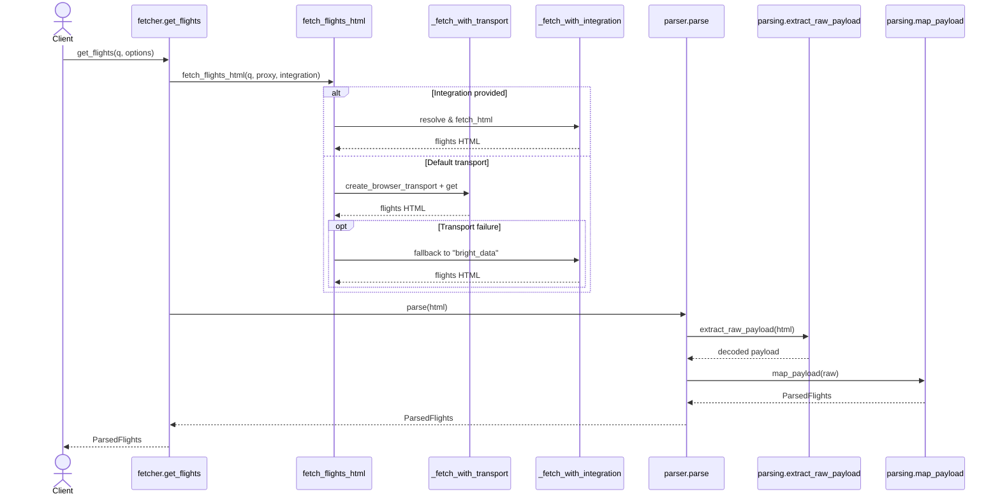

# Architecture Overview

Fast Flights is organised around three layers to keep scraping logic extensible:

- **Domain** – pure data structures and validation helpers (`fast_flights_opinionated.query_builder`, `fast_flights_opinionated.query_models`). They shape flight requests without talking to the network.
- **Infrastructure** – transport clients and integrations (`fast_flights_opinionated.transport`, `fast_flights_opinionated.integrations`). They decide *how* we fetch HTML.
- **Parsing** – extractors and mappers (`fast_flights_opinionated.parsing`). They transform HTML into strongly-typed results.

The public API modules (`fast_flights_opinionated.querying`, `fast_flights_opinionated.parser`, `fast_flights_opinionated.fetcher`) re-export these building blocks so existing imports continue to work.

## fast_flights_opinionated data flow

The opinionated wrapper layers transport fallbacks on top of the core query and parsing building blocks. The diagram below shows how data flows from caller code through query construction, HTTP fetching, and parsing:

```mermaid
flowchart TD
    A[Caller code] --> B[create_query / Query]
    B --> C[get_flights / fetch_flights_html]
    C --> D{Explicit integration?}
    D -- No --> E[_fetch_with_transport -> create_browser_transport -> TransportClient.get]
    E --> F[HTML response]
    D -- Yes --> G[_fetch_with_integration -> Integration.fetch_html]
    G --> F
    F --> H[parse]
    H --> I[extract_raw_payload]
    I --> J[map_payload]
    J --> K[ParsedFlights (Flights + JsMetadata)]
```

Key takeaways:
- Callers either provide a natural-language string or `Query`; `create_query` ensures validation and normalization.
- The default transport impersonates a browser; failures fall back to registered integrations such as BrightData.
- Parsing is split into extraction (locating the script payload) and mapping (building strongly typed models).

## Function call chain

The following sequence diagram captures the main control flow when `fast_flights_opinionated.get_flights` is invoked:



## Adding a new integration

1. Implement a subclass of `Integration` that consumes a `TransportClient` and pulls configuration via `Integration.require_setting`.
2. Reuse `fast_flights_opinionated.transport.PrimpTransportClient` or provide your own adapter.
3. Register the integration by calling `register_integration("your-name", YourIntegration)` inside `fast_flights/integrations/__init__.py` or an extension module.
4. Consumers can now call `get_flights(..., integration="your-name", integration_options={...})`.

## Extending query builders

- Use `FlightQuery`/`Passengers` from `fast_flights_opinionated.query_builder` for validation.
- Convert to protobuf when needed through `query_to_proto` or the convenience methods on `Query`.
- Avoid instantiating protobuf messages directly in application code—centralised mappers make schema upgrades easier.

## Parsing pipeline tips

- `fast_flights_opinionated.parsing.extractor.extract_raw_payload` isolates HTML scraping logic. Add feature detection or fallbacks here if Google changes their markup.
- `fast_flights_opinionated.parsing.mapper.map_payload` is the single place that understands the raw payload structure. Keep it small and covered by tests so schema drift is spotted quickly.
- The `ParsedFlights` sequence carries metadata alongside flight listings; prefer returning it instead of plain lists so consumers keep access to airline/alliances data.
